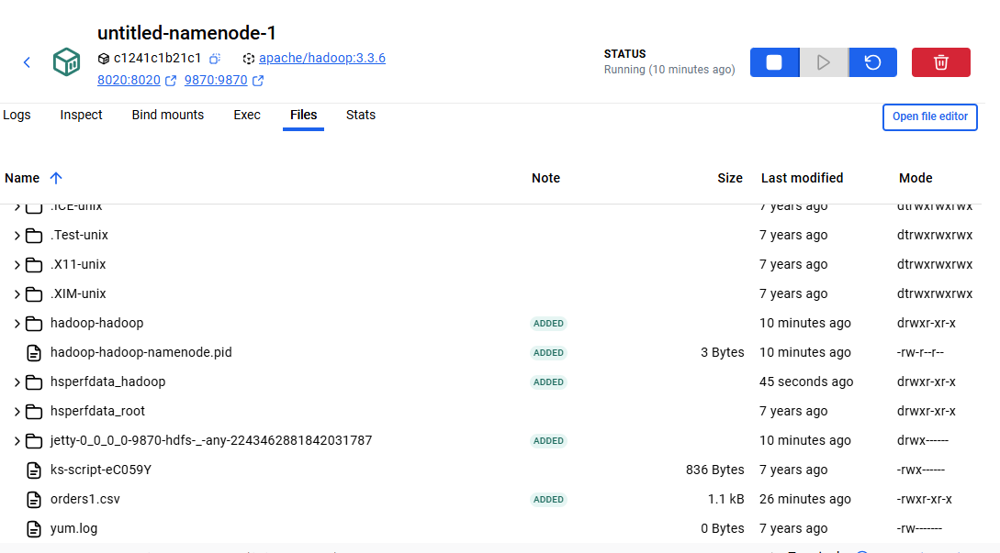

# Rapport TP Spark Structured Streaming

  

Ce TP met en place un mini-cluster Hadoop/Spark en conteneurs, charge des fichiers CSV dans HDFS puis exécute un job Spark Structured Streaming pour agréger les commandes.

  

## Architecture et prérequis

- `docker-compose.yaml` : lance HDFS (namenode/datanode + Yarn) et un cluster Spark standalone (master + worker).

- Données d'entrée : `orders1.csv`, `orders2.csv`, `orders3.csv` copiés dans HDFS sous `/data`.

- Jar de l'application : `target/untitled-1.0-SNAPSHOT.jar` construit via Maven.

  


  

## Mise en route

1. Démarrer l'environnement : `docker-compose up -d`.

2. Copier les CSV dans le conteneur namenode puis dans HDFS :

   ```bash

   docker cp orders2.csv untitled-namenode-1:/tmp/

   docker exec -it untitled-namenode-1 hdfs dfs -put /tmp/orders2.csv /data/

   # Répéter pour orders1.csv et orders3.csv

   ```

   

   

3. Vérifier la présence des fichiers via l'UI HDFS ou `hdfs dfs -ls /data` :

   

  

## Lancement du job Spark

Soumission depuis le conteneur master :

```bash

docker exec -it spark-master /opt/spark/bin/spark-submit \

  --class com.tp.Main \

  --master spark://spark-master:7077 \

  /tmp/app.jar

```


  

## Résultats du streaming

- Lecture de `/data` en streaming, affichage console en mode `complete`.

- Chaque batch correspond à l'arrivée d'un fichier CSV.

  

Batch 0 (orders1) :


  

Batch 1 (orders2) :


  

Batch 2 (orders3) :


  

## Agrégation finale

Le job regroupe par `order_id` et calcule `sum(total)`. Résumé observé dans la console :


  

